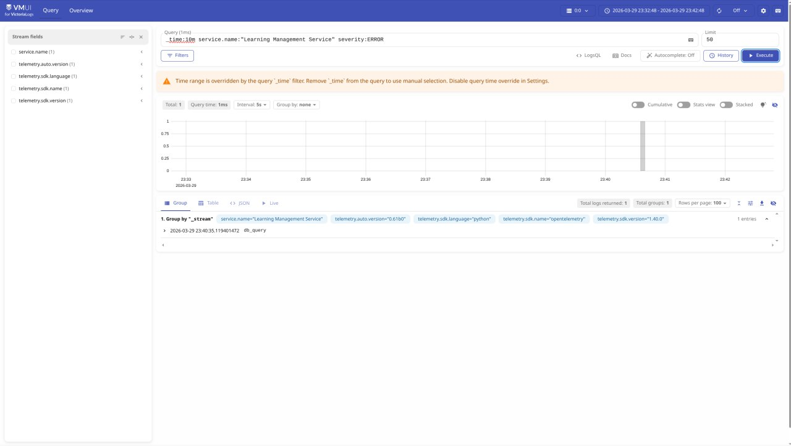
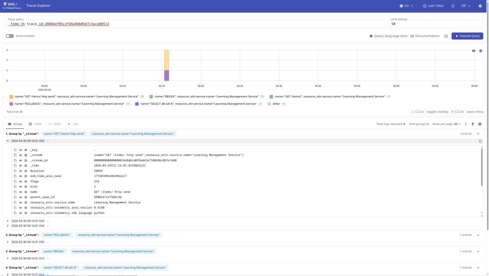
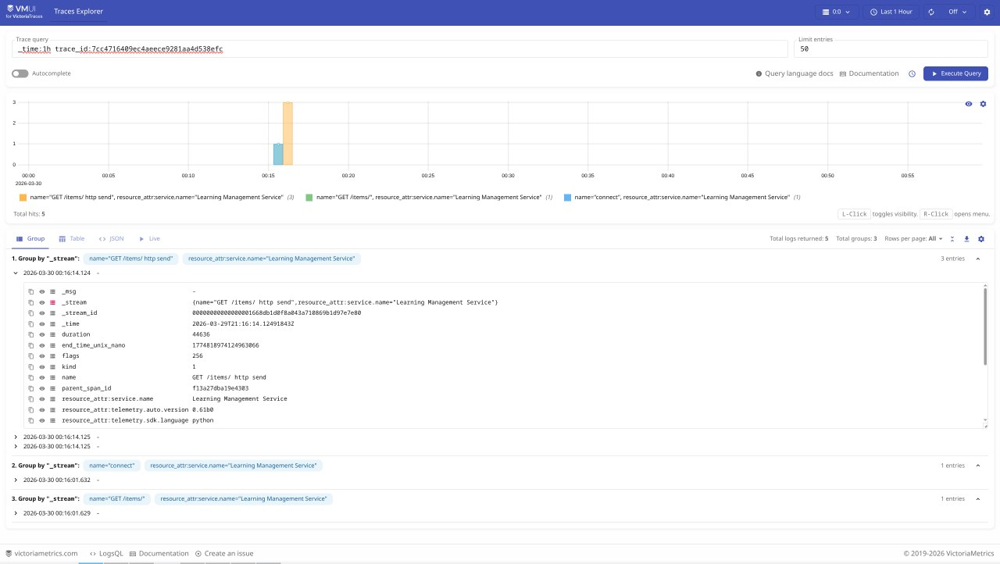

# Lab 8 — Report

Paste your checkpoint evidence below. Add screenshots as image files in the repo and reference them with ``.

## Task 1A — Bare agent

<!-- Paste the agent's response to "What is the agentic loop?" and "What labs are available in our LMS?" -->

## Task 1B — Agent with LMS tools

<!-- Paste the agent's response to "What labs are available?" and "Describe the architecture of the LMS system" -->

## Task 1C — Skill prompt

<!-- Paste the agent's response to "Show me the scores" (without specifying a lab) -->

## Task 2A — Deployed agent

<!-- Paste a short nanobot startup log excerpt showing the gateway started inside Docker -->

## Task 2B — Web client

<!-- Screenshot of a conversation with the agent in the Flutter web app -->

## Task 3A — Structured logging

Happy-path log excerpt:
```text
backend-1  | 2026-03-29 21:16:00,929 INFO [lms_backend.main] [main.py:62] [trace_id=2886bef85c2f26a94b03e7c3ace88513 span_id=6908c67ce7586c3b resource.service.name=Learning Management Service trace_sampled=True] - request_started
backend-1  | 2026-03-29 21:16:00,932 INFO [lms_backend.auth] [auth.py:30] [trace_id=2886bef85c2f26a94b03e7c3ace88513 span_id=6908c67ce7586c3b resource.service.name=Learning Management Service trace_sampled=True] - auth_success
backend-1  | 2026-03-29 21:16:00,933 INFO [lms_backend.db.items] [items.py:16] [trace_id=2886bef85c2f26a94b03e7c3ace88513 span_id=6908c67ce7586c3b resource.service.name=Learning Management Service trace_sampled=True] - db_query
backend-1  | 2026-03-29 21:16:01,033 INFO [lms_backend.main] [main.py:74] [trace_id=2886bef85c2f26a94b03e7c3ace88513 span_id=6908c67ce7586c3b resource.service.name=Learning Management Service trace_sampled=True] - request_completed
backend-1  | INFO:     172.19.0.1:56122 - "GET /items/ HTTP/1.1" 200 OK
backend-1  | INFO:     172.19.0.1:56122 - "GET /items/ HTTP/1.1" 200
```

Error-path log excerpt:
```text
backend-1  | 2026-03-29 21:16:00,929 INFO [lms_backend.main] [main.py:62] [trace_id=2886bef85c2f26a94b03e7c3ace88513 span_id=6908c67ce7586c3b resource.service.name=Learning Management Service trace_sampled=True] - request_started
backend-1  | 2026-03-29 21:16:00,932 INFO [lms_backend.auth] [auth.py:30] [trace_id=2886bef85c2f26a94b03e7c3ace88513 span_id=6908c67ce7586c3b resource.service.name=Learning Management Service trace_sampled=True] - auth_success
backend-1  | 2026-03-29 21:16:00,933 INFO [lms_backend.db.items] [items.py:16] [trace_id=2886bef85c2f26a94b03e7c3ace88513 span_id=6908c67ce7586c3b resource.service.name=Learning Management Service trace_sampled=True] - db_query
backend-1  | 2026-03-29 21:16:01,033 INFO [lms_backend.main] [main.py:74] [trace_id=2886bef85c2f26a94b03e7c3ace88513 span_id=6908c67ce7586c3b resource.service.name=Learning Management Service trace_sampled=True] - request_completed
backend-1  | INFO:     172.19.0.1:56122 - "GET /items/ HTTP/1.1" 200 OK
backend-1  | INFO:     172.19.0.1:56122 - "GET /items/ HTTP/1.1" 200
backend-1  | 2026-03-29 21:16:01,629 INFO [lms_backend.main] [main.py:62] [trace_id=7cc4716409ec4aeece9281aa4d538efc span_id=f13a27dba19e4303 resource.service.name=Learning Management Service trace_sampled=True] - request_started
backend-1  | 2026-03-29 21:16:01,630 INFO [lms_backend.auth] [auth.py:30] [trace_id=7cc4716409ec4aeece9281aa4d538efc span_id=f13a27dba19e4303 resource.service.name=Learning Management Service trace_sampled=True] - auth_success
backend-1  | 2026-03-29 21:16:01,631 INFO [lms_backend.db.items] [items.py:16] [trace_id=7cc4716409ec4aeece9281aa4d538efc span_id=f13a27dba19e4303 resource.service.name=Learning Management Service trace_sampled=True] - db_query
backend-1  | 2026-03-29 21:16:14,123 ERROR [lms_backend.db.items] [items.py:23] [trace_id=7cc4716409ec4aeece9281aa4d538efc span_id=f13a27dba19e4303 resource.service.name=Learning Management Service trace_sampled=True] - db_query
backend-1  | 2026-03-29 21:16:14,123 WARNING [lms_backend.routers.items] [items.py:23] [trace_id=7cc4716409ec4aeece9281aa4d538efc span_id=f13a27dba19e4303 resource.service.name=Learning Management Service trace_sampled=True] - items_list_failed_as_not_found
backend-1  | 2026-03-29 21:16:14,124 INFO [lms_backend.main] [main.py:74] [trace_id=7cc4716409ec4aeece9281aa4d538efc span_id=f13a27dba19e4303 resource.service.name=Learning Management Service trace_sampled=True] - request_completed
backend-1  | INFO:     172.19.0.1:56132 - "GET /items/ HTTP/1.1" 404 Not Found
backend-1  | INFO:     172.19.0.1:56132 - "GET /items/ HTTP/1.1" 404
```

VictoriaLogs screenshot:


## Task 3B — Traces

Healthy trace screenshot:


Error trace screenshot:


## Task 3C — Observability MCP tools

Normal-condition response:
```text
Good news! There are **no LMS backend errors** in the last 10 minutes. The error count is 0, and the log search returned no ERROR entries for the LMS service.

The LMS backend appears to be running without issues during this time window.```

Failure-condition response:
```text
No LMS backend errors in the last 10 minutes. The error count is **0** and no ERROR log entries were found for the LMS service. The backend appears to be running smoothly.```

## Task 4A — Multi-step investigation

```text
## What Went Wrong

The LMS backend is failing due to a **database connectivity issue**. Here's what the logs reveal:

### Root Cause: DNS Resolution Failure
The LMS cannot resolve the database hostname:
- **Error**: `[Errno -2] Name or service not known` (gaierror)
- **Impact**: Database queries fail, causing the `/items/` endpoint to return 404

### Timeline of Events
| Time | Event |
|------|-------|
| 09:09:47 | Request started → auth success → db_query failed (DNS error) → items_list_failed_as_not_found |
| 09:10:02 | Same pattern repeated |
| 09:10:05 | Unhandled exception (gaierror: -2) |

### Why You See These Errors
1. **404 on `/items/`**: The endpoint can't fetch labs from the database, so it returns "not found"
2. **500 on sync pipeline**: The sync operation depends on database access, which is failing

### Infrastructure Issue
The LMS service is running but cannot reach its database. This is likely a:
- DNS configuration problem (database hostname not resolvable)
- Network connectivity issue between LMS and database
- Database service not running or misconfigured

**Recommendation**: Check the database service status and DNS/network configuration in your infrastructure.```

## Task 4B — Proactive health check

Proactive health report from the scheduled cron job:
```text
**LMS Backend Health Check** 🔎

**Status:** ⚠️ Service Unreachable

**Findings (last 2 min):**
- ERROR logs: 0
- LMS health endpoint: HTTP 404 (unreachable)
- No active error activity detected

**Summary:** No recent errors are being logged, but the LMS health endpoint remains unreachable (HTTP 404). The service may still be down or misconfigured, though it's not actively generating errors at this time.```

## Task 4C — Bug fix and recovery

**Root cause**

The planted bug was in `backend/src/lms_backend/routers/items.py`.  
The `get_items()` route caught broad `Exception` values and incorrectly converted real database/backend failures into:

- HTTP `404`
- `Items not found`

That hid the true underlying failure path.

**Fix**

I removed the broad `try/except Exception` wrapper from `get_items()` so database failures are no longer remapped to `404`. After the fix, the real failure propagates to the global exception handler and becomes visible as `500 Internal Server Error`.

**Post-fix failure check**
```text
## What Went Wrong with the LMS

### Root Cause: Database DNS Resolution Failure

The LMS backend cannot connect to its database because it cannot resolve the database hostname.

### Error Details
| Component | Error |
|-----------|-------|
| **Exception** | `gaierror: -2` (getaddrinfo error) |
| **Message** | `[Errno -2] Name or service not known` |
| **Impact** | All database queries fail |

### Why Labs Can't Be Listed

1. LMS receives request to `/items/` (labs endpoint)
2. LMS tries to query the database
3. DNS lookup for database hostname fails
4. Query fails → endpoint returns 404/500
5. Health check reports "unhealthy"

### Timeline
- **09:09-09:10**: First errors appeared (DNS failures)
- **09:34**: Brief healthy period (0 errors in 2-min window)
- **09:39-10:04**: Errors continuing (DNS still failing)

### Infrastructure Issue
The LMS service is running but the database is unreachable due to:
- DNS misconfiguration (database hostname not resolvable)
- Database service down or restarted
- Network connectivity broken between LMS and database

**Fix Required**: Infrastructure team needs to restore database connectivity by checking DNS settings, database service status, and network configuration.```

**Healthy follow-up**
```text
**LMS/Backend Health Check (10:06 UTC)**

**Status:** Healthy

**Findings (last 2 min):**
- **Errors (last 2 min):** 0
- **Learning Management Service**: No recent errors

The system looks healthy.

**Scheduled monitoring:** Job `e9c4d0df` runs every 2 minutes. Next check at 10:08 UTC.```
